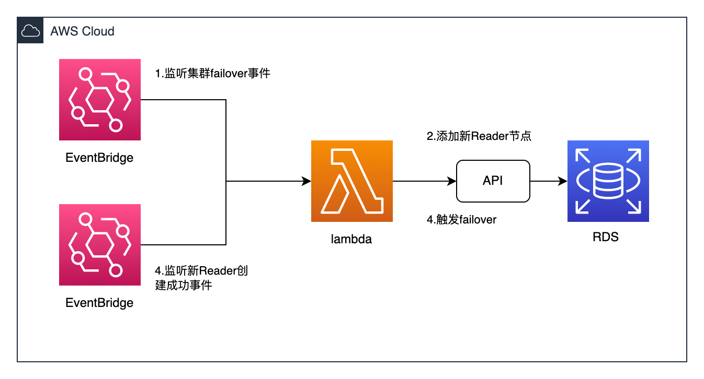
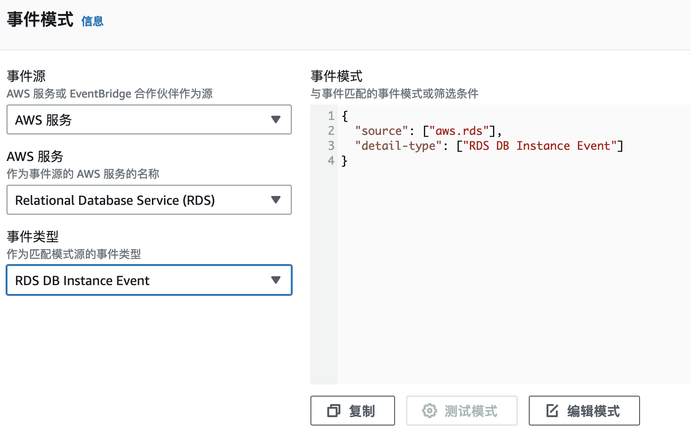
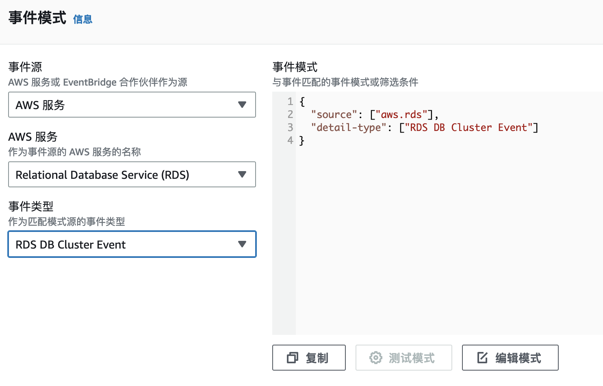

# AWS Aurora Failover 自动恢复

Aurora 偶发Failover时，会把Reader节点提升为Writer节点，如果原来Writer的机型配置比Reader大，比如Writer是`xlarge`,而Reader是`larger`，Failover后会导致新的Writer无法抗住的问题。本项目通过监听Failover事件，自动添加一个和原Writer一样的新Reader节点，然后主动触发Failover到此节点，以解决此问题。
## 目录

- [AWS Aurora Failover 自动恢复](#aws-aurora-failover-自动恢复)
  - [目录](#目录)
    - [上手指南](#上手指南)
          - [配置要求](#配置要求)
          - [安装步骤](#安装步骤)
    - [文件目录说明](#文件目录说明)
    - [部署](#部署)
    - [部署Lambda](#部署lambda)
      - [创建Lambda 执行角色，添加以下策略](#创建lambda-执行角色添加以下策略)
      - [创建Lambda 函数](#创建lambda-函数)
    - [设置EventBridge](#设置eventbridge)
      - [创建监听集群Failover规则](#创建监听集群failover规则)
      - [创建监听实例创建成功的规则](#创建监听实例创建成功的规则)
    - [注意事项](#注意事项)
    - [版本控制](#版本控制)
    - [作者](#作者)

### 上手指南

完成自动failover恢复需要以下步骤：
1. 通过Eventbridge 捕获Failover事件
2. 获取源集群信息，源写入实例信息，创建一个原写入节点一样的配置的读取器，并且把Failover 优先级设置为0
3. 通过Eventbridge 捕获新实例创建完成事件
4. 触发Failover，把新的读取节点提升为新Writer节点

###### 配置要求

1. Lambda python 3.9

###### 安装步骤
```sh
git clone https://github.com/hillday/aws_aurora_failover_restore.git
```

### 文件目录说明

```
aws_aurora_failover_restore 
├── README.md
├── /images/
├── lambda_function.py # lambda 函数
```

### 部署
主要是部署Lambda和设置EventBridge
### 部署Lambda
Lambda 部署需要：
1. 创建Lambda执行角色
2. Lambda 设置

#### 创建Lambda 执行角色，添加以下策略
1. 内联策略`LambdaInlinePolicy`

```json
{
    "Version": "2012-10-17",
    "Statement": [
        {
            "Effect": "Allow",
            "Action": "logs:CreateLogGroup",
            "Resource": "arn:aws:logs:REGION:ACCOUNT:*"
        },
        {
            "Effect": "Allow",
            "Action": [
                "logs:CreateLogStream",
                "logs:PutLogEvents"
            ],
            "Resource": [
                "arn:aws:logs:REGION:ACCOUNT:log-group:/aws/lambda/Aurora-Failover-AutoRestore:*"
            ]
        },
        {
            "Action": [
                "iam:PassRole"
            ],
            "Resource": "arn:aws:iam::ACCOUNT:role/rds-monitoring-role",
            "Effect": "Allow"
        }
    ]
}
```
添加AWS托管的`AmazonRDSFullAccess`策略。
*需要把json文档中的`REGION`,`ACCOUNT`替换为实际的区域、账号*

#### 创建Lambda 函数
 创建`aws-aurora-failover`函数，把`lambda_function.py`代码复制替换到函数中。
> 兼容架构选择 `x86_64`

> 兼容运行时选择 `Python 3.9`

*执行角色选择为上面的创建的角色。*


### 设置EventBridge
#### 创建监听集群Failover规则

目标指向上面创建的Lambda 函数

#### 创建监听实例创建成功的规则

目标指向上面创建的Lambda 函数

### 注意事项
1. Failover过程会有数秒中断，需要评估业务侧是否可以容忍
2. 新创建的实例提升为Writer后不会删除任何读取节点，需要删除需要手动
3. Failover针对每个集群每天只能执行一次
4. 除了此方案外，最佳建议是Reader节点设置一个和Writer一样的机型，并设置故障转移优先级为0或者1，这样Failover的时候就能到此节点
5. 在此方案正式使用前，请进行充分测试

### 版本控制

该项目使用Git进行版本管理。您可以在repository参看当前可用版本。

### 作者

qchunhai
